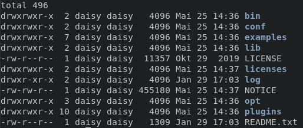
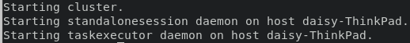
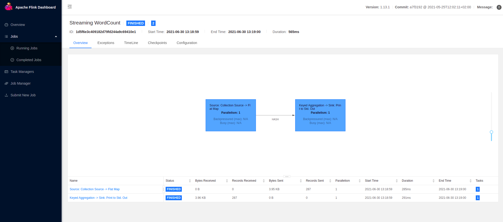
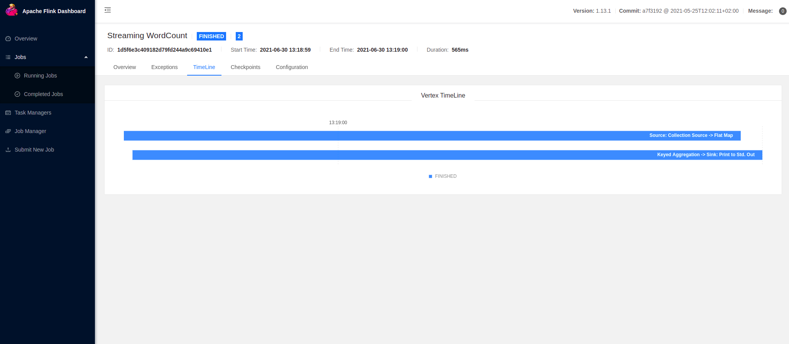

# 开始

欢迎来到Flink的世界!:)

Flink用于快速处理流式数据。这里先简单展示一下如何下载最新稳定版的Flink，然后安装并运行。我们跑一个简单的Flink作业，并使用Web界面来看一下效果。

## 下载

> 注意：Flink支持[Docker镜像](https://hub.docker.com/_/flink)

Flink需要类似UNIX环境，比如Linux、Mac OS、Cygwin（Windows上）。需要提前安装**Java 11**。在控制台中看一下你的Java版本：

```shell
$ java -version
```

下载[最新版本](https://flink.apache.org/downloads.html)的Flink并解压：

```shell
$ tar -xzf flink-*.tgz
```

## 目录结构

进入解压好的目录，看一下里面有什么：

```shell
$ cd flink-* && ls -l
```

然后你应该会看到：



至此你会发现：

- **bin/** 目录包含了`flink`二进制文件，以及管理各种作业、任务相关的bash脚本
- **conf/** 里面是配置文件，包括[Flink配置文件](../07部署/04配置.md#flink配置文件)
- **examples/** 则给出了一些示例应用

## 本地集群的启动和停止

执行下面的命令启动一个本地集群：

```shell
$ ./bin/start-cluster.sh
```

然后你会看到：



此时Flink以后台进程的形式启动。可以用下面的命令看一下：

```shell
$ ps aux | grep flink
```

打开Web页面的地址[localhost:8081](http://localhost:8081)，可以看到Flink集群已经启动。

执行下面的命令快速停止Flink及其组件：

```shell
$ ./bin/stop-cluster.sh
```

## 提交一个Flink作业

Flink提供了命令行工具**bin/flink**，用来运行和控制JAR包作业。提交一个[作业(job)](../03概念/04术语.md#flink作业job)就是要上传作业的JAR包以及相关依赖到Flink集群上然后执行。

**examples/** 目录中包含了一些示例作业。

执行下面的命令，将示例中的单词计数作业提交到集群上：

```shell
$ ./bin/flink run examples/streaming/WordCount.jar
```

使用下面的命令来观察运行日志：

```shell
$ tail log/flink-*-taskexecutor-*.out
```

输出：

```text
  (nymph,1)
  (in,3)
  (thy,1)
  (orisons,1)
  (be,4)
  (all,2)
  (my,1)
  (sins,1)
  (remember,1)
  (d,4)
```

同时可以在[Web界面](http://localhost:8081)上监控作业的运行状态。

可以看到这次任务中的数据是怎么流转的：



在这个作业中有两个算子(Operator)。第一个是source算子，从数据源读取数据。第二个是转换算子，聚合单词计数的结果。详见[DataStream算子](../04应用开发/02DataStream%20API/06算子/01概要.md)

还可以看到作业执行的时间线：



现在你已经成功运行了一个[Flink应用](../03概念/04术语.md#flink应用application)！可以尝试一下**examples/** 目录中的其他JAR包，或者部署一个你自己的作业！

# 小结

你下载了Flink安装文件，看了看目录结构，操作了本地集群的启动和停止，然后提交了一个Flink作业！

关于Flink基础知识的其他部分，可以看看[概念](../03概念/01概要.md)章节。如果想要尝试一些更加实际的东西，选一个教程看看。