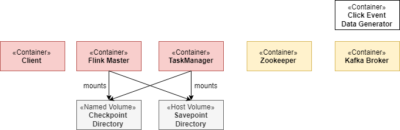
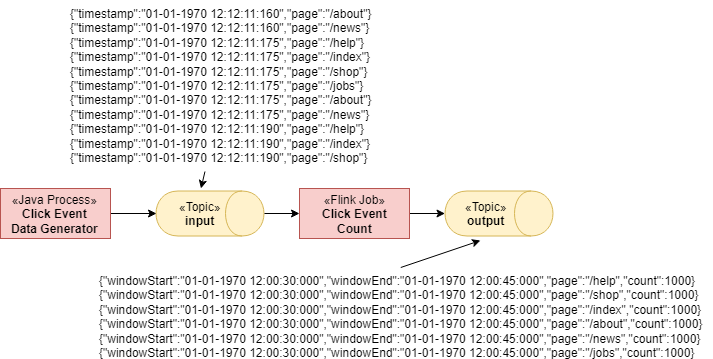
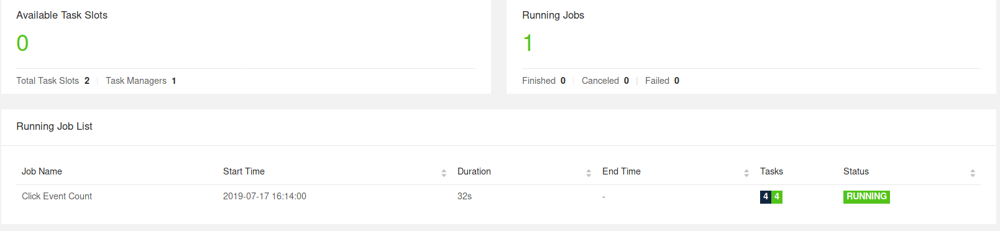
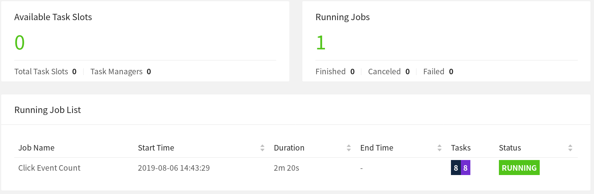

# Flink运维练习

Flink的部署和运维，在不同环境中有不同的方法。但不论怎么变，一个Flink集群的基本结构是不变的，用的都是相似的运维法则。

## 环境介绍

这次练习要做的包括一个长期运行的[Flink会话集群](../03概念/05术语.md#flink会话集群)和一个Kafka集群。

一个Flink集群包括一个[JobManager](../03概念/05术语.md#jobmangager)和一个或多个[TaskManager](../03概念/05术语.md#taskmanager)。JobManager负责处理[Job](../03概念/05术语.md#flink作业job)的提交、监管以及资源管理。TaskManager则担任工作进程，负责执行真正的[Task](../03概念/05术语.md#task)，Job也就是由Task组成的。本次练习中，一开始你只弄一个TaskManager，但紧接着就会扩展出多个TaskManager。本次练习还会搞一个专门的*客户端*容器，我们一开始会用它来提交Flink Job，后面继续用它来搞各种运维动作。*客户端*容器并不属于Flink集群本身，只是拿来简化操作。

Kafka集群包括一个Zookeeper和一个Kafka Broker。



练习环境启动后，一个名为*Flink Event Count*的Job会提交到JobManager。还会创建两个Kafka Topic，一个*input*，一个*output*。



我们的Job从*input*消费`ClickEvent`，每条事件包含一个`timestamp`和一个`page`。然后这些事件以`page`为key进行分区，并且划出一个15秒的[窗口](../04应用开发/02DataStream%20API/06算子/02窗口.md)。计算结果写出到*output*中。

## 开始操练

这个练习环境几步就可以搭起来。我们带你操作这些命令，还会告诉你如何验证操作的正确性。

我们假设你已经安装了[Docker](https://docs.docker.com/)（1.12+）和[docker-compose](https://docs.docker.com/compose/)（2.1+）。

需要的配置文件都在[flink-playgrounds](https://github.com/apache/flink-playgrounds)这个代码仓库中。首先要把代码拉下来然后构建docker镜像。

```shell
git clone https://github.com/apache/flink-playgrounds.git
cd flink-playgrounds/operations-playground
docker-compose build
```

启动环境：

```shell
docker-compose up -d
```

用下面的命令看一下启动的Docker容器：

```shell
docker-compose ps

                    Name                                  Command               State                   Ports                
-----------------------------------------------------------------------------------------------------------------------------
operations-playground_clickevent-generator_1   /docker-entrypoint.sh java ...   Up       6123/tcp, 8081/tcp                  
operations-playground_client_1                 /docker-entrypoint.sh flin ...   Exit 0                                       
operations-playground_jobmanager_1             /docker-entrypoint.sh jobm ...   Up       6123/tcp, 0.0.0.0:8081->8081/tcp    
operations-playground_kafka_1                  start-kafka.sh                   Up       0.0.0.0:9094->9094/tcp              
operations-playground_taskmanager_1            /docker-entrypoint.sh task ...   Up       6123/tcp, 8081/tcp                  
operations-playground_zookeeper_1              /bin/sh -c /usr/sbin/sshd  ...   Up       2181/tcp, 22/tcp, 2888/tcp, 3888/tcp
```

此时你的客户端容器已经把Job（`Exit 0`）成功提交了，所有集群组件以及数据生成器都起来了（`up`）

执行下面的命令可以停止练习环境：

```shell
docker-compose down -v
```

## 查看环境

这里你可以尝试很多东西。下面两小节会给你展示如何跟Flink集群交互，以及它的一些关键特性。

### Flink WebUI

查看Flink集群的最简单的方式就是用WebUI，我们的环境地址是[http://localhost:8081](http://localhost:8081)。如果一切正常，你会看到集群中有一个TaskManager，并且执行了一个名为*Click Event Count*的Job。



WebUI中包含了大量有用的信息（JobGraph、Metrics、Checkpoint Statistics、TaskManager Statue，……）

### 日志

#### JobManager

JobManager的日志可以用docker-compose命令来跟踪。

```shell
docker-compose logs -f jobmanager
```

在初始启动之后，每次检查点（checkpoint）完成后都会有日志。

#### TaskManager

TaskManager的日志也可以用同样的方式跟踪。

```shell
docker-compose logs -f taskmanager
```

在初始启动之后，每次检查点（checkpoint）完成后都会有日志。

### Flink CLI

在客户端容器中可以使用[Flink CLI](../07部署/06命令行.md)。比如先看一下`help`信息

```shell
docker-compose run --no-deps client flink --help
```

### REST API

[REST API](../08运维/04REST%20API.md#API)暴露在主机的`localhost:8081`，或者也可以在客户端容器中通过`jobmanager:8081`访问，比如列出所有运行中的job：

```shell
curl localhost:8081/jobs
```

### Kafka Topic

可以用下面的命令看到被写入到Kafka中的数据

```shell
//input topic (1000 records/s)
docker-compose exec kafka kafka-console-consumer.sh \
  --bootstrap-server localhost:9092 --topic input

//output topic (24 records/min)
docker-compose exec kafka kafka-console-consumer.sh \
  --bootstrap-server localhost:9092 --topic output
```

## 玩起来吧

现在你学会了如何跟Flink以及Docker容器互动，我们来尝试一些常见的运维动作。这些操作彼此互不干扰，你可以按照你喜欢的顺序来做。基本上都是用[CLI](#flink-cli)和[REST API](#rest-api)完成。

### 列出运行中的作业

#### CLI

##### 命令

```shell
docker-compose run --no-deps client flink list
```

##### 输出

```shell
Waiting for response...
------------------ Running/Restarting Jobs -------------------
16.07.2019 16:37:55 : <job-id> : Click Event Count (RUNNING)
--------------------------------------------------------------
No scheduled jobs.
```

#### REST API

##### 请求

```shell
curl localhost:8081/jobs
```

##### 响应（格式化后）

```json
{
  "jobs": [
    {
      "id": "<job-id>",
      "status": "RUNNING"
    }
  ]
}
```

 里面的JobID是提交Job的时候生成的，执行跟Job相关的动作的时候会用到。

 ### 异常恢复

 在（部分）故障情况下，Flink提供仅有一次（exactly-once）执行保障。在本次练习中，你可以观察到这一现象，并在某种程度上对其进行验证。

 #### 第一步：观察输出

 如[上面](#环境介绍)所讲，本次练习中生成的事件可以让每个窗口正好包含1000条记录。所以为了验证Flink成功从TaskManager异常中恢复，没有丢失或重复数据，你可以跟踪输出topic，能观察到异常恢复后所有的窗口都正常，计数也对。

 读取*output*主题，让它一直开着，直到第三步异常恢复之后。

 ```shell
 docker-compose exec kafka kafka-console-consumer.sh \
  --bootstrap-server localhost:9092 --topic output
 ```

 #### 第二步：搞个破坏

 为了模拟部分故障的情况，你可以干掉一个TaskManager。这就相当于模拟生产环境中的TaskManager进程丢失、TaskManager服务器异常、框架或者用户代码抛出临时异常（比如外部资源临时不可用）。

 ```shell
 docker-compose kill taskmanager
 ```

 几秒后JobManager就会发现TaskManager没了，并终止相关的Job，然后立即重新提交Job尝试恢复。Job重启后，它的任务会停留在`SCHEDULED`状态，用紫色方块标出（见下图）。

 

 > **注意**：尽管任务部分被标记为SCHEDULED而非RUNNING状态，但整体Job的状态仍然会被标记为RUNNING。

 此时该Job的任务无法从`SCHEDULED`变为`RUNNING`，因为没有资源（TaskManager提供的TaskSlot）来运行这些任务。Job会一直重复提交、终止，直到有新的TaskManager可用。

 在此期间，数据生成器会一直向*input*推送`ClickEvent`。这就跟生产环境很像，Job虽然停了但数据一直在产生。

 #### 第三步：恢复

 重启TaskManager，它会重新连接到JobManager。

 ```shell
 docker-compose up -d taskmanager
 ```

 当JobManager发现有新的TaskManager之后，会把正在恢复中的任务调度到这些新的TaskSlot上。重启后，任务会根据异常发生前最后一次[checkpoint](../02学习Flink/06容错.md)来恢复状态，并进入`RUNNING`状态。

Job会快速处理Kafka中积压的输入事件（在不可用期间积累的），并以更快的速度（>24条/分钟）生成输出，直到跟上最新的进度。在*output*中你会看到所有的key（`page`）都在，所有的时间窗口也都在，并且每个窗口依旧是1000条记录。因为我们使用了[FlinkKafkaProducer](../06连接器/01DataStream连接器/06Kafka.md)的“至少一次”模式，你可能会看到重复的输出。

> **注意**：生产环境上都会用到资源管理器（Kubernetes、Yarn），自动重启失败的进程。

### Job的升级与扩缩

Flink Job的升级拢共分两步：首先，Flink Job优雅停止，而且有[Savepoint](../08运维/01状态与容错/03Savepoint.md)。一个Savepoint是整个应用状态的一个一致性快照，发生在一个明确定义且全局一致的时间点（跟checkpoint类似）。然后，升级后的Flink Job从Savepoint启动。这里的“升级”可能是以下这些操作：

- 改配置（包括修改并行度）
- Job拓扑调整（增删算子）
- 修改Job中用到的用户自定义函数

升级前你先tail着*output*，这样可以观察到升级过程中没有数据异常。

```shell
docker-compose exec kafka kafka-console-consumer.sh \
  --bootstrap-server localhost:9092 --topic output
```

#### 第一步：停止Job

要优雅停止Job，就要使用“stop”命令，用CLI或者REST API都行。这时候你就要用到JobID了，可以在WebUI中找到，也可以[列出所有Job](#列出运行中的作业)找到。有了JobID你就可以停止Job了：

##### CLI

###### 命令

```shell
docker-compose run --no-deps client flink stop <job-id>
```

###### 输出

```shell
Suspending job "<job-id>" with a savepoint.
Savepoint completed. Path: file:<savepoint-path>
```

Savepoint保存在`execution.checkpointing.savepoint-dir`指定的目录中，可以在[*Flink配置文件*](../07部署/04配置.md#flink配置文件)中修改，现在是挂到了你本机的 */tmp/flink-savepoints-directory/* 目录。下一步会用到这个路径。

##### REST API

###### 请求

```shell
# triggering stop
curl -X POST localhost:8081/jobs/<job-id>/stop -d '{"drain": false}'
```

###### 输出（格式化了）

```json
{
  "request-id": "<trigger-id>"
}
```

###### 请求

```shell
# check status of stop action and retrieve savepoint path
 curl localhost:8081/jobs/<job-id>/savepoints/<trigger-id>
```

###### 输出（格式化了）

```json
{
  "status": {
    "id": "COMPLETED"
  },
  "operation": {
    "location": "<savepoint-path>"
  }
}
```

#### 第2a步：不做改变直接重启

现在可以使用这个Savepoint来重启升级后的Job。为了简单说明，可以什么都不改直接重启。

##### CLI

###### 命令

```shell
docker-compose run --no-deps client flink run -s <savepoint-path> \
  -d /opt/ClickCountJob.jar \
  --bootstrap.servers kafka:9092 --checkpointing --event-time
```

###### 输出

```shell
Job has been submitted with JobID <job-id>
```

##### REST API

###### 请求

```shell
# Uploading the JAR from the Client container
docker-compose run --no-deps client curl -X POST -H "Expect:" \
  -F "jarfile=@/opt/ClickCountJob.jar" http://jobmanager:8081/jars/upload
```

###### 输出（格式化了）

```json
{
  "filename": "/tmp/flink-web-<uuid>/flink-web-upload/<jar-id>",
  "status": "success"
}
```

###### 请求

```shell
# Submitting the Job
curl -X POST http://localhost:8081/jars/<jar-id>/run \
  -d '{"programArgs": "--bootstrap.servers kafka:9092 --checkpointing --event-time", "savepointPath": "<savepoint-path>"}'
```

###### 输出（格式化了）

```json
{
  "jobid": "<job-id>"
}
```

当Job恢复到`RUNNING`后，你会看到`output`生成数据的速度变快了，因为Job要处理停服期间积压的数据。而且你会发现升级过程并没有导致数据丢失：所有窗口都在，而且都是1000条数据。

#### 第2b步：修改并行度（扩缩）并重启Job

你可以使用这个Savepoint然后对Job进行扩缩，需要在重新提交的时候修改以下并行度。

##### CLI

###### 命令

```shell
docker-compose run --no-deps client flink run -p 3 -s <savepoint-path> \
  -d /opt/ClickCountJob.jar \
  --bootstrap.servers kafka:9092 --checkpointing --event-time
```

###### 输出

```shell
Starting execution of program
Job has been submitted with JobID <job-id>
```

##### REST API

###### 请求

```shell
# Uploading the JAR from the Client container
docker-compose run --no-deps client curl -X POST -H "Expect:" \
  -F "jarfile=@/opt/ClickCountJob.jar" http://jobmanager:8081/jars/upload
```

###### 输出（格式化了）

```json
{
  "filename": "/tmp/flink-web-<uuid>/flink-web-upload/<jar-id>",
  "status": "success"
}
```

###### 请求

```shell
# Submitting the Job
curl -X POST http://localhost:8081/jars/<jar-id>/run \
  -d '{"parallelism": 3, "programArgs": "--bootstrap.servers kafka:9092 --checkpointing --event-time", "savepointPath": "<savepoint-path>"}'
```

###### 输出（格式化了）

```json
{
  "jobid": "<job-id>"
}
```

现在Job重新提交了，但是它起不来，因为增加并行度后导致没有足够的TaskSlot来执行任务（2个可用，但需要3个）。

```shell
docker-compose scale taskmanager=2
```

这样可以再加一个TaskManager，包含两个TaskSlot，它会自动注册到JobManager。加完之后过一小会儿Job就起来了。

当Job恢复到“RUNNING”后，你会看到*output*没有丢失这期间的数据：所有的window都在，而且都是1000条记录。

### 查看Job的Metric

JobManager会将系统和用户级的[metric](../08运维/02Metric.md)通过REST API暴露出来。

请求地址跟具体指标类型有关。Job相关的就在`jobs/<job-id>/metrics`。可以加一个`get`参数获取特定metric的数值。

#### 请求

```shell
curl "localhost:8081/jobs/<jod-id>/metrics?get=lastCheckpointSize"
```

#### 响应（格式化了）

```json
[
  {
    "id": "lastCheckpointSize",
    "value": "9378"
  }
]
```

REST API不光可以查metric，也可以获取Job运行的状态详情。

#### 请求

```shell
# find the vertex-id of the vertex of interest
curl localhost:8081/jobs/<jod-id>
```

#### 响应（格式化了）

```json
{
  "jid": "<job-id>",
  "name": "Click Event Count",
  "isStoppable": false,
  "state": "RUNNING",
  "start-time": 1564467066026,
  "end-time": -1,
  "duration": 374793,
  "now": 1564467440819,
  "timestamps": {
    "CREATED": 1564467066026,
    "FINISHED": 0,
    "SUSPENDED": 0,
    "FAILING": 0,
    "CANCELLING": 0,
    "CANCELED": 0,
    "RECONCILING": 0,
    "RUNNING": 1564467066126,
    "FAILED": 0,
    "RESTARTING": 0
  },
  "vertices": [
    {
      "id": "<vertex-id>",
      "name": "ClickEvent Source",
      "parallelism": 2,
      "status": "RUNNING",
      "start-time": 1564467066423,
      "end-time": -1,
      "duration": 374396,
      "tasks": {
        "CREATED": 0,
        "FINISHED": 0,
        "DEPLOYING": 0,
        "RUNNING": 2,
        "CANCELING": 0,
        "FAILED": 0,
        "CANCELED": 0,
        "RECONCILING": 0,
        "SCHEDULED": 0
      },
      "metrics": {
        "read-bytes": 0,
        "read-bytes-complete": true,
        "write-bytes": 5033461,
        "write-bytes-complete": true,
        "read-records": 0,
        "read-records-complete": true,
        "write-records": 166351,
        "write-records-complete": true
      }
    },
    {
      "id": "<vertex-id>",
      "name": "ClickEvent Counter",
      "parallelism": 2,
      "status": "RUNNING",
      "start-time": 1564467066469,
      "end-time": -1,
      "duration": 374350,
      "tasks": {
        "CREATED": 0,
        "FINISHED": 0,
        "DEPLOYING": 0,
        "RUNNING": 2,
        "CANCELING": 0,
        "FAILED": 0,
        "CANCELED": 0,
        "RECONCILING": 0,
        "SCHEDULED": 0
      },
      "metrics": {
        "read-bytes": 5085332,
        "read-bytes-complete": true,
        "write-bytes": 316,
        "write-bytes-complete": true,
        "read-records": 166305,
        "read-records-complete": true,
        "write-records": 6,
        "write-records-complete": true
      }
    },
    {
      "id": "<vertex-id>",
      "name": "ClickEventStatistics Sink",
      "parallelism": 2,
      "status": "RUNNING",
      "start-time": 1564467066476,
      "end-time": -1,
      "duration": 374343,
      "tasks": {
        "CREATED": 0,
        "FINISHED": 0,
        "DEPLOYING": 0,
        "RUNNING": 2,
        "CANCELING": 0,
        "FAILED": 0,
        "CANCELED": 0,
        "RECONCILING": 0,
        "SCHEDULED": 0
      },
      "metrics": {
        "read-bytes": 20668,
        "read-bytes-complete": true,
        "write-bytes": 0,
        "write-bytes-complete": true,
        "read-records": 6,
        "read-records-complete": true,
        "write-records": 0,
        "write-records-complete": true
      }
    }
  ],
  "status-counts": {
    "CREATED": 0,
    "FINISHED": 0,
    "DEPLOYING": 0,
    "RUNNING": 4,
    "CANCELING": 0,
    "FAILED": 0,
    "CANCELED": 0,
    "RECONCILING": 0,
    "SCHEDULED": 0
  },
  "plan": {
    "jid": "<job-id>",
    "name": "Click Event Count",
    "type": "STREAMING",
    "nodes": [
      {
        "id": "<vertex-id>",
        "parallelism": 2,
        "operator": "",
        "operator_strategy": "",
        "description": "ClickEventStatistics Sink",
        "inputs": [
          {
            "num": 0,
            "id": "<vertex-id>",
            "ship_strategy": "FORWARD",
            "exchange": "pipelined_bounded"
          }
        ],
        "optimizer_properties": {}
      },
      {
        "id": "<vertex-id>",
        "parallelism": 2,
        "operator": "",
        "operator_strategy": "",
        "description": "ClickEvent Counter",
        "inputs": [
          {
            "num": 0,
            "id": "<vertex-id>",
            "ship_strategy": "HASH",
            "exchange": "pipelined_bounded"
          }
        ],
        "optimizer_properties": {}
      },
      {
        "id": "<vertex-id>",
        "parallelism": 2,
        "operator": "",
        "operator_strategy": "",
        "description": "ClickEvent Source",
        "optimizer_properties": {}
      }
    ]
  }
}
```

可以查看[REST API参考](../08运维/04REST%20API.md#API)，那里有完整的接口文档，包括其他类型的接口（比如TaskManager的metric）。

## 参数

你可能会发现*Click Event Count*这个应用启动的时候加了`--checkpointing`和`--event-time`。可以在`docker-compose.yaml`文件中的*client*容器配置中去掉这两个参数，这样也会改变Job的行为。

- `--checkpointing`用来开启[checkpoint](../02学习Flink/06容错.md)，也就是Flink的容错机制。如果不带它，然后走一遍[异常恢复](#异常恢复)，你会发现数据丢了。
- `--event-time`用来开启[事件时间语义](../03概念/03即时流处理.md)。如果不开，Job会根据实际时间而非`ClickEvent`的时间戳将它们划分到窗口中。结果就是每个窗口中的记录条数不一定都是1000条了。

*Click Event Count*还有一个选项，默认关掉了，打开之后可以观察Job出现反压（backpressure）时的表现。可以在`docker-compose.yaml`文件的*client*容器中加上这个选项。

- `--backpressure`可以在Job流程中增加一个算子，在偶数分钟时刻（比如10:12，但不是10:13）触发强烈的反压。可以通过多种[网络metric](../08运维/02Metric.md#默认传输服务)来观察到这个现象，比如`outputQueueLength`和`outPoolUsage`，或者到WebUI中的[反压监控](../08运维/07监控/02反压监控.md)中查看。