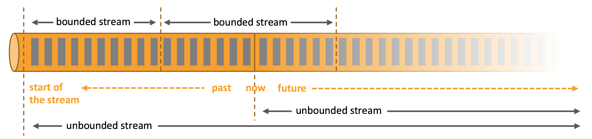
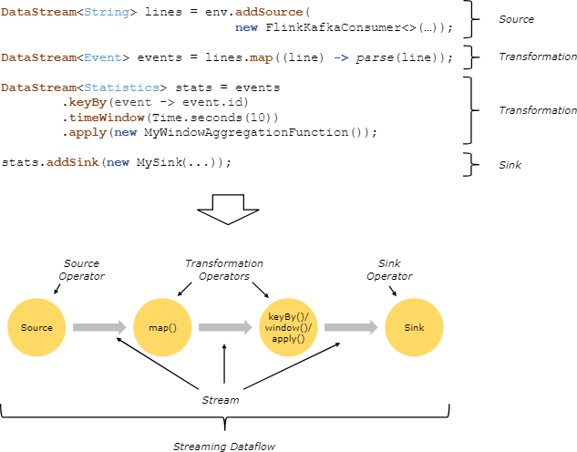
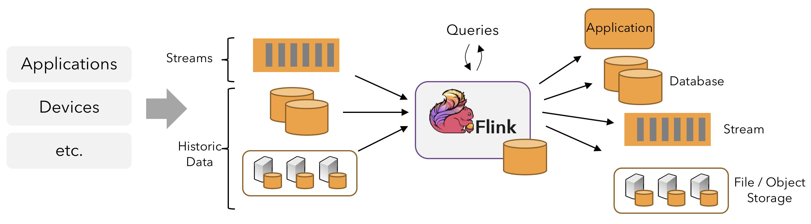
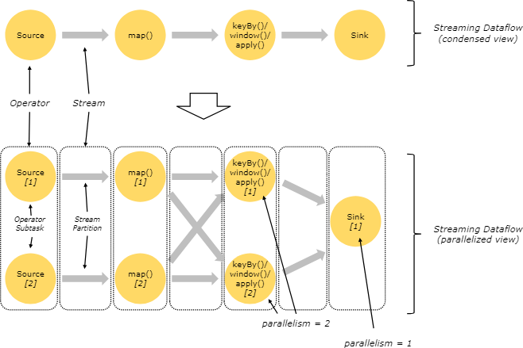
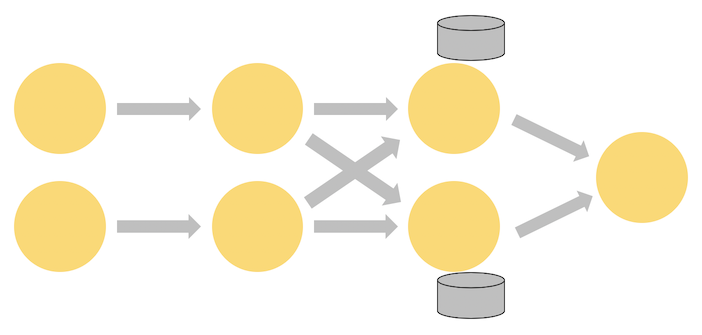
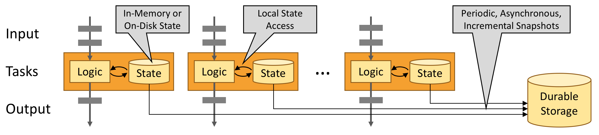

# 学习Flink：实战训练

## 目标与范畴

本次学习带你了解Apache Flink，包含了足够的知识，帮你开始编写可扩缩的流式ETL、数据分析、以及事件驱动型应用，同时也省去了大量的（仍然相当重要的）细节。目的是带你直入Flink的API，管理状态与时间，希望你能够掌握这些基础知识，这样才能更好的理解其他那些详细的参考文档。每节最后的链接可以带你了解更多知识。

本次练习你会学习到：

- 如何实现流式数据处理管道
- Flink为什么要以及如何管理状态
- 如何利用事件时间来一致地进行准确的数据分析
- 如何在连续数据流上构建事件驱动型应用
- Flink如何容错，如何在有状态流处理上实现准确一次（exactly-once）语义

本次练习聚焦四大关键概念：数据流的连续处理，事件时间，有状态流处理，状态快照。本节就为你引入这些概念。

> **注意**：练习中包含了实操内容，带你深入理解这些概念。每节最后会给出相关练习的链接。

## 流式处理

流是数据的自然形态。不管它是来自web服务的事件，股票交易，或者某个工厂机器上的传感器读数，数据都是以某种流的形式产生的。但当你分析数据的时候，你只能在`bounded`或者`unbounded`流上组织你的处理方式，选用哪种范式会产生巨大的影响。

**批处理**是属于有界（bounded）数据流范式。在这种模式下，你可以在开始计算结果之前把整个数据集都注入进来，这样就可以对数据排序，计算一些全局统计数据，或者根据全部的输入数据生成一个最终的总结报表。

**流处理**则属于无界（unbounded）数据流范式。理论上讲，输入数据是无尽的，所以你必须不停的在数据到达时进行处理。

在Flink中，应用由**流式数据（streaming dataflow）**组成，可以通过用户定义的**算子**对其进行变形处理。这种数据流会形成有向图，起点是一个或多个**source**，终点是一个或多个**sink**。

程序中所作的变形通常跟数据流中的算子都有一对一的关系。但也有些变形操作包括了多个算子。

应用可能会从流式数据源消费实时数据，比如消息队列，分布式日志，类似Kafka或者Kinesis。但Flink也可以通过多种数据源处理有界的历史数据。同样，Flink应用所产生的结果流也可以写出到多个系统中，它们作为sink连接到程序中。

### 并行流

Flink中的程序本质上就是分布式并行的。在执行过程中，一个流包含了一个或多个**流分区（stream partition）**，每个算子包含了一个或多个**算子子任务（operator substask）**。这些子任务彼此独立，可以在不同的线程甚至不同的机器或容器中运行。

子任务的数量就是该算子的**并行度（parallelism）**。同一个程序的不同算子可以有不同的并行度。

两个算子之间的数据传输可以是`one-to-one`（或者叫转发）模式，也可以是`redistributing`模式：

- **one-to-one**（比如上图的source到map）保留了元素的分区和顺序。也就是说map()算子的subtask[1]看到的元素顺序和source算子的subtask[1]是一致的。
- **redistributing**（比如上图的map()到keyBy/window，以及keyBy/window到sink）改变了流的分区。每个算子的子任务将数据发送给不同的目标子任务，具体要看它用的哪种变形。比如keyBy()（对key进行hash后实现再分区），broadcast()，以及rebalance()（随机再分区）。在这种重新分发的交换中，元素的顺序只能保持在每一对发送和接收的子任务之间（比如map()的subtask[1]和keyBy/window的subtask[2]）。比如上图中keyBy/window和sink算子之间的重新分发，就会带来不确定的顺序，不同key的聚合结果到达sink的顺序不确定。

## 即时流处理

对于大部分流处理应用，如果可以用同样的代码来处理实时数据和历史数据，那将是非常有意义的——而且生成的结果也是确定的、一致的。

而且要非常关注事件发生的顺序，而非它们送达处理的顺序，而且要能够确定一组事件何时（应当）结束。比如电商交易、金融交易。

这些即时流处理的要求都可以通过事件时间戳来满足，它们记录在数据流中，而非使用机器处理该数据的实际时间。

## 有状态流处理

Flink的操作可以是有状态的。这就是说一个事件该如何处理可以取决于它之前的事件的积累效果。状态的使用可以很简单，比如统计每分钟的事件数量，打到看板上，也可以很复杂，比如计算欺诈检测模型的特征。

Flink应用是并行运行在一个分布式集群上的。一个算子的多个并行实例各自独立执行，可以是在各自的线程中，也可以是在不同的机器上。

有状态算子的并行实例相当于一个分片的kv存储。每个并行实例负责处理一组特定key的事件，这些key的状态则保存在实例本地。

下图展示的Job中，头三个算子的并行度为2，最终的sink并行度为1。第三个算子是有状态的，你能看到在第二和第三个算子间出现了一个全连接网络shuffle。这就是对某种key做分区实现的，以确保需要一起处理的事件能够被一起处理。

状态都是在本地访问的，这样可以满足高吞吐和低延迟的需求。可以把状态保存在JVM堆中，如果太大，也可以在磁盘上以高效的数据结构组织起来。

## 基于状态快照的容错

Flink有容错和精确一次（exactly-once）语义，这是结合状态快照和流重放功能实现的。这些快照可以捕获分布式管道的整体状态，记录输入队列的偏移量，以及作业图中自数据生成以来的状态。出现异常时，source会被回退到故障发生前，状态和处理过程都会被恢复。如上图所示，这些状态快照都是异步生成的，不会影响正在进行的数据处理。