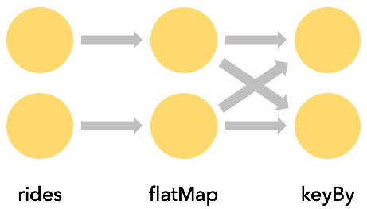
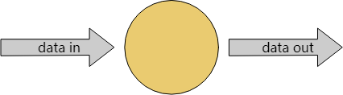
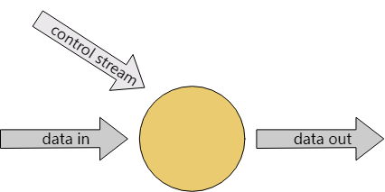

# 数据管道与ETL

Flink常用于实现ETL（extract，transform，load）管道，从一个或多个地方读取数据，做一些处理，然后把结果写到另一个地方。本节我们就来看看用Flink的DataStream API如何实现这种应用。

Flink的[Table和SQL API](../04应用开发/03TableAPI和SQL/01概要.md)适用于很多ETL场景。但不论最终你是否要用DataStream API，对于这里要讲的基础知识有一个充分的了解都是很有帮助的。

## 无状态变形

本节要为你介绍`map()`和`flatmap()`，它们是实现无状态变形的两个基本操作。本节假设你已经熟悉了[flink-training-repo](https://github.com/apache/flink-training/tree/release-1.20/)中出租车出行数据的用法。

### `map()`

在上一节的练习中，你学会如何对出租车出行数据进行过滤。代码仓库中有一个`GeoUtils`类，其中有一个静态方法`GeoUtils.mapToGridCell(float lon, float lat)`，它可以将一个经纬度位置映射成纽约市的一个100×100米的网格。

现在我们把之前的出行数据对象丰富一下，加上`startCell`和`endCell`。我们可以继承`TaxiRide`：

```java
public static class EnrichedRide extends TaxiRide {
    public int startCell;
    public int endCell;

    public EnrichedRide() {}

    public EnrichedRide(TaxiRide ride) {
        this.rideId = ride.rideId;
        this.isStart = ride.isStart;
        ...
        this.startCell = GeoUtils.mapToGridCell(ride.startLon, ride.startLat);
        this.endCell = GeoUtils.mapToGridCell(ride.endLon, ride.endLat);
    }

    public String toString() {
        return super.toString() + "," +
            Integer.toString(this.startCell) + "," +
            Integer.toString(this.endCell);
    }
}
```

然后我们开始对流做变形处理

```java
DataStream<TaxiRide> rides = env.addSource(new TaxiRideSource(...));

DataStream<EnrichedRide> enrichedNYCRides = rides
    .filter(new RideCleansingSolution.NYCFilter())
    .map(new Enrichment());

enrichedNYCRides.print();
```

这里用到了`MapFunction`：

```java
public static class Enrichment implements MapFunction<TaxiRide, EnrichedRide> {

    @Override
    public EnrichedRide map(TaxiRide taxiRide) throws Exception {
        return new EnrichedRide(taxiRide);
    }
}
```

### `flatmap()`

`MapFunction`用于一对一变形：对于每一个元素`map()`都会生成一个对应的变形后的元素。对于非一对一变形，就要用到`flatmap()`

```java
DataStream<TaxiRide> rides = env.addSource(new TaxiRideSource(...));

DataStream<EnrichedRide> enrichedNYCRides = rides
    .flatMap(new NYCEnrichment());

enrichedNYCRides.print();
```

`FlatMapFunction`如下：

```java
public static class NYCEnrichment implements FlatMapFunction<TaxiRide, EnrichedRide> {

    @Override
    public void flatMap(TaxiRide taxiRide, Collector<EnrichedRide> out) throws Exception {
        FilterFunction<TaxiRide> valid = new RideCleansing.NYCFilter();
        if (valid.filter(taxiRide)) {
            out.collect(new EnrichedRide(taxiRide));
        }
    }
}
```

有了接口中提供的`Collector`，`flatmap()`可以生成任意多的元素，甚至不生成也可以。

## 用Key划分

### `keyBy()`

经常会需要按照元素的某个属性对数据流进行分区，这样相同属性值的元素就会被分到一个组里。比如你想找到每个网格出发的行程中时长最长的行程。按照SQL语句的思路，就是要根据`startCell`做某种GROUP BY，在Flink中就是要用`keyBy(KeySelector)`

```java
rides
    .flatMap(new NYCEnrichment())
    .keyBy(enrichedRide -> enrichedRide.startCell);
```

每次`keyBy`都会触发一次网络传输（network shuffle），对流进行再分区。这个代价一般都比较高，因为这其中涉及到网络通信和序列化以及反序列化。



### key可以通过计算得出

KeySelector不仅限于从数据中提取key。可以按照你的思路来计算出需要的key，只要得出的key是确定的就可以，而且它实现了`hashCode()`和`equals()`。这些限制导致KeySelector无法生成随机数，或者返回Array以及Enum，但是你也可以用Tuple或者POJO来实现复合key，只要它们的元素都满足这些要求就可以。

Key必须以确定的方式生成，因为要用它的时候可能会重复计算它，而不是直接附加到数据本身上。

比如我们不用给`EnrichRide`类增加`startCell`属性，而是这样

```java
keyBy(enrichedRide -> enrichedRide.startCell);
```

甚至也可以这样：

```java
keyBy(ride -> GeoUtils.mapToGridCell(ride.startLon, ride.startLat));
```

### 根据Key来做聚合

这段代码为每个行程结束事件生成了一个新的Tuple流，包括`startCell`和行程时长（分钟）：

```java
import org.joda.time.Interval;

DataStream<Tuple2<Integer, Minutes>> minutesByStartCell = enrichedNYCRides
    .flatMap(new FlatMapFunction<EnrichedRide, Tuple2<Integer, Minutes>>() {

        @Override
        public void flatMap(EnrichedRide ride,
                            Collector<Tuple2<Integer, Minutes>> out) throws Exception {
            if (!ride.isStart) {
                Interval rideInterval = new Interval(ride.startTime, ride.endTime);
                Minutes duration = rideInterval.toDuration().toStandardMinutes();
                out.collect(new Tuple2<>(ride.startCell, duration));
            }
        }
    });
```

现在我们就可以生成一个新的流，其中只包含每个`startCell`当前遇到的时长最长的行程。

Key的表达方式有很多。上面你已经用过`EnrichedRide`这个POJO，它的Key就直接用属性名表达出来了。此时我们要用的变成了`Tuple2`对象，可以用Tuple内的索引（从0开始）来指定key。

```java
minutesByStartCell
  .keyBy(value -> value.f0) // .keyBy(value -> value.startCell)
  .maxBy(1) // duration
  .print();
```

输出结果中每个key每次出现一个新的最大值时就会输出一条记录，比如下面的50797号网格：

```text
...
4> (64549,5M)
4> (46298,18M)
1> (51549,14M)
1> (53043,13M)
1> (56031,22M)
1> (50797,6M)
...
1> (50797,8M)
...
1> (50797,11M)
...
1> (50797,12M)
```

### （隐式）状态

这是我们在练习中首次遇到有状态的流处理。这里的状态被透明处理了，Flink需要跟踪每个Key的最大行程时长。

一旦你的应用中涉及到状态处理，那你就要想想这个状态会有多大。Key的范围可能是无界的，那么需要处理的状态也同样无界。

在做流式处理的时候，通常是要考虑每个有限窗口内的聚合问题，而不是从整个流的角度去看。

### `reduce()`以及其他的聚合

上面用到的`maxBy()`只是`KeyedStream`中的聚合算法之一。还有一个更通用的`reduce()`函数，可以实现一些自定义的聚合算法。

## 有状态变形

### 为什么Flink要管理状态？

你当然可以不用Flink管状态，自己管，但Flink管状态的话可以提供一些非常有说服力的特性：

- **本地化**：Flink的状态保存在处理状态的本机上，访问速度可以达到如同访问内存一般
- **持久化**：Flink的状态有容错性，比如它可以按固定间隔做检查点，出现异常时自动恢复
- **垂直扩展**：Flink的状态可以保存在嵌入式的RocksDB实例中，通过添加更多本地磁盘就可以扩展
- **水平扩展**：Flink的状态可以随着集群的扩缩重新分发

本节你可以学到如何用Flink的API来管理状态。

### 多功能的函数

至此你已经见到过一些Flink的函数接口了，包括`FilterFunction`，`MapFunction`，`FlatMapFunction`。这些都属于单一抽象方法模式（Single Abstract Method）。

对于这些接口，Flink都提供了一个对应的“多功能”变种，比如`RichFlatMapFunction`，它包括了一些额外的方法，比如：

- `open(Configuration c)`
- `close()`
- `getRuntimeContext()`

`open()`只会在算子初始化的时候调用一次。可以用来加载一些静态数据，或者建立一个对外链接。

`getRuntimeContext()`可以让你访问到大量有趣的东西，最重要的就是可以用它来创建并访问Flink管理的状态。

### 带Key的状态

现在假设你想对流中的事件去重，所以对于每个Key只需要保留第一个事件就可以。下面就是一个这样的例子，使用了一个名为`Deduplicator`的`RichFlatMapFunction`。

```java
private static class Event {
    public final String key;
    public final long timestamp;
    ...
}

public static void main(String[] args) throws Exception {
    StreamExecutionEnvironment env = StreamExecutionEnvironment.getExecutionEnvironment();
  
    env.addSource(new EventSource())
        .keyBy(e -> e.key)
        .flatMap(new Deduplicator())
        .print();
  
    env.execute();
}
```

为了实现这个功能，`Deduplicator`需要以某种方式记住每个Key是否有对应的事件已经出现过了。它会用到Flink的*keyed state*接口。

当你处理这种有key的流时，Flink会为其管理的每个状态维护一个kv存储。

Flink支持多种类型的带key状态，而例子中用到的只是最简单的一个，叫做`ValueState`。它的意思是*对每个key*，Flink只保存一个对象，这个例子中就是一个`Boolean`对象。

`Deduplicator`有两个方法：`open()`和`flatMap()`。前者通过定义`ValueStateDescriptor<Boolean>`来初始化状态托管。构造方法的参数中给出了该状态的名字（“keyHasBeenSeen”），以及状态序列化时需要的信息（这里给的就是`Types.BOOLEAN`）。

```java
public static class Deduplicator extends RichFlatMapFunction<Event, Event> {
    ValueState<Boolean> keyHasBeenSeen;

    @Override
    public void open(Configuration conf) {
        ValueStateDescriptor<Boolean> desc = new ValueStateDescriptor<>("keyHasBeenSeen", Types.BOOLEAN);
        keyHasBeenSeen = getRuntimeContext().getState(desc);
    }

    @Override
    public void flatMap(Event event, Collector<Event> out) throws Exception {
        if (keyHasBeenSeen.value() == null) {
            out.collect(event);
            keyHasBeenSeen.update(true);
        }
    }
}
```

在flatMap方法中调用`keyHasBeenSeen.value()`时，Flink运行时会根据*上下文中的这个key*去查找它对应的状态值，只有当值为`null`的时候才会继续，并将该事件进行输出。同时还要将`keyHasBeenSeen`更新为`true`。

这种访问及更新带key状态的机制看上去非常有意思，因为我们实现的`Deduplicator`中并没有明确的用到key。当Flink运行时调用`open`方法时并没有可见的事件，上下文中也没有key。但调用`flatMap`方法时，事件对应的key对于运行时来说却是可见的，在底层用到了key，用来确定到底要访问哪个状态数据。

当我们把它部署在一个分布式的集群上时，会有多个`Deduplicator`实例，每一个负责处理整个keyspace中无交叉的一个子集。因此当你只看到一个`ValueState`声明时，比如

```java
ValueState<Boolean> keyHasBeenSeen;
```

要明白它代表的并不是一个Boolean，而是一个分布式、有分片的kv存储。

### 清理状态

上面的例子中有个问题：如果keyspace是无界的该怎么办？Flink为每个不同的key在某个地方存储了一个`Boolean`实例。如果key的范围是有界的还好，但如果key以无界的方式增长，那就需要对于不再使用的key做状态清理。可以调用状态对象的`clear()`方法：

```java
keyHasBeenSeen.clear();
```

如果某个key在一段时间内处于不活动状态，那你就可以调用这个方法清理一下。在介绍事件驱动型应用的那节中，学习`ProcessFunction`的时候你会看到如何利用Timer来实现这个逻辑。

构造状态的时候有一个[状态TTL](../04应用开发/02DataStream%20API/04状态和容错/01状态.md#状态TTL)选项，可以指定过期key的状态什么时候自动清理。

### 不带key的状态

可以在无key上下文中使用托管状态。这玩意有时候称作[算子状态](../04应用开发/02DataStream%20API/04状态和容错/01状态.md#算子状态)。涉及的接口有些不一样，由于用户函数中并不常用这个东西，所以此处不做介绍。这个特性常用于source和sink的实现中。

## 链接流

有的时候需要的可能不仅仅是像这样用一些预定义的变形：



而是希望对变形的某些方便做一些动态的调整，比如加一些阈值或者规则等其他参数。Flink把这种模式称为*链接流（connected stream）*，比如一个算子有两个输入流：



链接流也可以用来实现流的join。

### 示例

在本例中，control流给出了需要在`streamOfWords`中过滤掉的单词。在链接流上调用了名为`ControlFunction`的`RichCoFlatMapFunction`。

```java
public static void main(String[] args) throws Exception {
    StreamExecutionEnvironment env = StreamExecutionEnvironment.getExecutionEnvironment();

    DataStream<String> control = env
        .fromElements("DROP", "IGNORE")
        .keyBy(x -> x);

    DataStream<String> streamOfWords = env
        .fromElements("Apache", "DROP", "Flink", "IGNORE")
        .keyBy(x -> x);
  
    control
        .connect(streamOfWords)
        .flatMap(new ControlFunction())
        .print();

    env.execute();
}
```

注意被链接的两个流必须以相互兼容的方式划key。`keyBy`的作用是对流中的数据分区，当带key的流链接起来，它们必须以同样的方式分区才行。这样可以保证两个流中key相同的事件能够被发送给相同的实例。这样该key的流才叫做被链接起来了。

例子中的两个流都是`DataStream<String>`类型，都是以字符串作为key。下面你会看到，`RichCoFlatMapFunction`在带key状态中保存了一个Boolean值，这个Boolean是被两个流共享的。

```java
public static class ControlFunction extends RichCoFlatMapFunction<String, String, String> {
    private ValueState<Boolean> blocked;
      
    @Override
    public void open(Configuration config) {
        blocked = getRuntimeContext()
            .getState(new ValueStateDescriptor<>("blocked", Boolean.class));
    }
      
    @Override
    public void flatMap1(String control_value, Collector<String> out) throws Exception {
        blocked.update(Boolean.TRUE);
    }
      
    @Override
    public void flatMap2(String data_value, Collector<String> out) throws Exception {
        if (blocked.value() == null) {
            out.collect(data_value);
        }
    }
}
```

`RichCoFlatMapFunction`也是一种`FlatMapFunction`，可以应用在一对链接流上，而且可以利用到多功能函数接口。这就是说它可以支持有状态处理。

Boolean类型的`blocked`用来记住在`control`流中出现过的key（单词），这些单词需要从`streamOfWords`流中过滤掉。它是一个*带key*状态，在两个流中共享，这就是为什么两个流的keyspace也需要一致。

Flink运行时在处理这两个链接流的时候会分别调用`flatMap1`和`flatMap2`，在这个例子中，`control`流的元素会被传给`flatMap1`，`streamOfWords`流的元素则被传给`flatMap2`。这是由两个流链接的顺序决定的：`control.connect(streamOfWords)`。

一定要注意，你是无法控制`flatMap1`和`flatMap2`的调用顺序的。这两个流要彼此竞速，Flink运行时先从哪个流中消费是不确定的。如果时间或顺序很重要，你可以将事件缓冲到Flink托管状态中，直到应用可以开始处理它们。如果你真的非常纠结这个东西，对于有两个输入流的这种情况，可以自己实现一个[InputSelectable](https://nightlies.apache.org/flink/flink-docs-release-1.20/api/java//org/apache/flink/streaming/api/operators/InputSelectable.html)自定义算子，对输入流的消费顺序做一些有限的控制。

## 实操

本节的实操是[Rides and Fares](https://github.com/apache/flink-training/blob/release-1.20//rides-and-fares)。