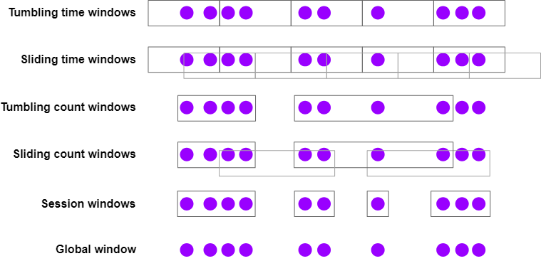

# 流式分析

## Event Time和Watermark

### 介绍

Flink中包含三种时间概念：

- *event time*：事件发生的时间，由设备生成（或存储）事件时进行记录
- *ingestion time*：事件注入到Flink时由Flink记录的一个时间戳
- *processing time*：管道中某个算子处理事件的时间

为了实现可重复计算，比如计算某只股票在交易日的第一个小时内的最高价，就要用event time。这样计算出的结果不依赖何时进行计算。这种实时应用有时也会用processing time，但是这样得到的结果依赖于事件什么时候被处理，而不是什么时候发生。依赖于processing time的分析会出现不一致，而且难以再次分析历史数据或者验证一些新的方案。

### 使用Event Time

如果你要用event time，那你还需要提供一个Timestamp Extractor和Watermark Generator，Flink要用它们来跟踪event time的进度。这些内容会在[使用Watermark](#使用watermark)中详细介绍，但首先我们要了解什么是watermark。

### Watermark

让我们通过一个简单的例子来看看为什么要用到watermark。

假设有一个带时间戳的事件流，以某种无序的方式抵达。数字代表事件发生的时间戳。第一个到达的事件发生时间戳为4，然后是时间戳2：

<center>··· 23 19 22 24 21 14 17 13 12 15 9 11 7 2 4 →</center>

现在假设你要对流做一个排序。这就需要处理流中的每个事件，然后生成一个新的流，包含同样的事件，但是按时间戳排序。

一些思路：

（1）你看到的第一个元素是4，但是你不能立即放走它，因为有可能更早的事件还没有过来。从上面的例子中你可以看到这个流的样子，你需要等2过来之后才能生成一部分结果。

*需要做一些缓冲和延迟处理。*

（2）如果做的不对，可能导致一直等下去。先看到了4，然后是2，那么后面是不是还有比2更小的呢？有可能。也有可能你一直等不到1。

*最终你不得不鼓起勇气把2作为有序流的第一个元素放出去。*

（3）需要定义某种策略，对于一个时间戳，要有一个等待时长限制。

*这就是watermark的作用，定义何时不再等待更早的事件。*

Event time的处理依赖于*watermark generator*为流中插入带有特殊时间戳的元素，称为*watermark*。时间*t*的watermark表示时间*t*之前的元素（可能）都已经到达了。

对于我们的排序，应该何时停止等待，并将2作为有序流的第一个元素放出去呢？那就是等2的watermark到达，或者是一个比2大的watermark到达。

（4）也可以尝试一些其他的方法来生成watermark。

每个事件的到达都有一定的延迟，这些延迟的大小也不尽相同。一种简单的方法是假设一个最大延迟。Flink把这种策略称为*bounded-out-of-orderness*。可以想一些更复杂的方法来生成watermark，但对于大部分应用来说这种设定最大值的方法已经足够了。

### 延迟与完整性

作为应用的开发者，你可以把watermark看作是为你在延迟和完整性之间提供了一个权衡。不同于批处理，生成结果之前能够知道完整的输入信息，流处理中你必须在一定程度上停止接收更多的输入然后生成结果。

你可以把watermark配置的更加激进，缩小延迟上限，这样的代价就是生成的结果可能没有掌握足够的输入信息，甚至生成的太快导致错误的结果。或者你也可能多等一会儿，掌握更多的输入信息之后再生成结果。

也可以搞一种混合实现，一开始生成很快，然后补充生成一些对已生成结果的更新数据。这种方案对某些应用来说也是不错的。

### 迟到

迟到是相对于watermark的。`Watermark(t)`表示时间*t*之前的事件都已到达，后面再遇到时间戳≤*t*的都算作迟到。

### 使用Watermark

为了实现基于事件时间的处理，Flink需要知道每个事件对应的时间，而且需要在流中加入watermark。

实操中的Taxi数据源已经为你处理了这些细节。但你自己的应用中就要自己琢磨了，通常需要搞一个类用来提取事件的时间戳并生成watermark。最简单的就是用`WatermarkStrategy`：

```java
DataStream<Event> stream = ...;

WatermarkStrategy<Event> strategy = WatermarkStrategy
        .<Event>forBoundedOutOfOrderness(Duration.ofSeconds(20))
        .withTimestampAssigner((event, timestamp) -> event.timestamp);

DataStream<Event> withTimestampsAndWatermarks =
    stream.assignTimestampsAndWatermarks(strategy);
```

## 窗口（Window）

Flink为窗口设计了表达力非常强的语义。

本节你会学习到：

- 如何用窗口在流上实现聚合，
- Flink支持的窗口类型，
- 如何使用窗口聚合实现一个DataStream程序

### 介绍

为了应对下面这些问题，进行流式处理时需要对流中的子集进行聚合计算：

- 每分钟的页面访问次数
- 每个用户每周的登录次数
- 每个传感器每分钟的最大温度值

窗口化分析基于两个主要的抽象：*Window Assigner*负责将事件加入到窗口（必要时创建新的窗口对象），*Window Function*用来处理窗口中的事件。

窗口API中还包括*Trigger*，用来判断何时调用window function和*Evictor*，后者可以将事件从窗口中移除。

基本用法如下：

```java
stream
    .keyBy(<key selector>)
    .window(<window assigner>)
    .reduce|aggregate|process(<window function>);
```

也可以用在无key流中，但注意此时*无法*并行处理：

```java
stream
    .windowAll(<window assigner>)
    .reduce|aggregate|process(<window function>);
```

### Window Assigner

Flink提供如下内置的window assigner：



对应场景及用法如下：

- Tumbling time window
    - *每分钟页面访问次数*
    - `TumblingEventTimeWindows.of(Time.minutes(1))`
- Sliding time window
    - *每10秒计算一次每分钟页面访问次数*
    - `SlidingEventTimeWindows.of(Time.minutes(1), Time.seconds(10))`
- Session window
    - *每次会话的页面访问次数，30分钟内没有新的操作就算作一次会话结束*
    - `EventTimeSessionWindows.withGap(Time.minutes(30))`

时间长度可以用`Time.milliseconds(n)`，`Time.seconds(n)`，`Time.minutes(n)`，`Time.hours(n)`，`Time.days(n)`来指定。

基于时间（time-based）的window assigner（包括session window）可用于event time和processing time。这两种时间窗口之间无需做太多权衡。如果用processing time窗口，那就要接受这些限制：

- 无法正确处理历史数据，
- 无法正确处理无序数据，
- 结果是不确定的

但好处就是延迟较低。

基于数量（count-based）的窗口直到一批数量满足后才会触发，不存在超时处理部分窗口的情况，不过你可以用Trigger来实现这种行为。

Global窗口把每个事件（同样的key）添加到同一个全局窗口中。这种窗口只有在你用自定义Trigger搞自定义窗口的时候有用。其他场景中如果你觉得这种窗口可能也有用，那么你最好用[另一节](05事件驱动型应用#processfunction)中介绍的`ProcessFunction`代替。

### Window Function

窗口处理有三种基本的方式：

1. 按照批处理操作，使用`ProcessWindowFunction`，窗口中的内容会作为一个`Iterable`传过来；
2. 增量处理，用`ReduceFunction`或者`AggregateFunction`，在窗口的每个元素上进行调用；
3. 结合以上二者，先用`ReduceFunction`或`AggregateFunction`做聚合，然后再提交给一个`ProcessWindowFunction`。

下面是方法1和3的例子。在1分钟的event time窗口中得到每个传感器的最大值，然后生成一个Tuple流，包括`(key, end-of-window-timestamp, max_value)`。

#### ProcessWindowFunction示例

```java
DataStream<SensorReading> input = ...;

input
    .keyBy(x -> x.key)
    .window(TumblingEventTimeWindows.of(Time.minutes(1)))
    .process(new MyWastefulMax());

public static class MyWastefulMax extends ProcessWindowFunction<
        SensorReading,                  // input type
        Tuple3<String, Long, Integer>,  // output type
        String,                         // key type
        TimeWindow> {                   // window type
    
    @Override
    public void process(
            String key,
            Context context, 
            Iterable<SensorReading> events,
            Collector<Tuple3<String, Long, Integer>> out) {

        int max = 0;
        for (SensorReading event : events) {
            max = Math.max(event.value, max);
        }
        out.collect(Tuple3.of(key, context.window().getEnd(), max));
    }
}
```

需要注意：

- 要传给窗口的所有事件都要缓冲在Flink的带key状态中，直到窗口满足要求。这部分的代价可能会比较高。
- `ProcessWindowFunction`得到了一个`Context`对象，可以用它来得到窗口信息。它的接口如下：

```java
public abstract class Context implements java.io.Serializable {
    public abstract W window();
    
    public abstract long currentProcessingTime();
    public abstract long currentWatermark();

    public abstract KeyedStateStore windowState();
    public abstract KeyedStateStore globalState();
}
```

`windowState`和`globalState`可以为每个key的所有窗口存储按key（per-key）、按窗口（per-window），或者全局按key（global per-key）信息。这东西什么时候有用呢？比如你要记录当前窗口的一些信息，然后处理后续窗口的时候要用到。

#### 增量聚合示例

```java
DataStream<SensorReading> input = ...;

input
    .keyBy(x -> x.key)
    .window(TumblingEventTimeWindows.of(Time.minutes(1)))
    .reduce(new MyReducingMax(), new MyWindowFunction());

private static class MyReducingMax implements ReduceFunction<SensorReading> {
    public SensorReading reduce(SensorReading r1, SensorReading r2) {
        return r1.value() > r2.value() ? r1 : r2;
    }
}

private static class MyWindowFunction extends ProcessWindowFunction<
    SensorReading, Tuple3<String, Long, SensorReading>, String, TimeWindow> {

    @Override
    public void process(
            String key,
            Context context,
            Iterable<SensorReading> maxReading,
            Collector<Tuple3<String, Long, SensorReading>> out) {

        SensorReading max = maxReading.iterator().next();
        out.collect(Tuple3.of(key, context.window().getEnd(), max));
    }
}
```

注意`Iterable<SensorReading>`中只包含一个元素——`MyReducingMax`聚合得到的最大值。

## 迟到事件

使用event time窗口时，迟到事件默认会被丢弃。窗口API中提供了两种可以用来控制这种行为的方法。

可以把被丢掉的事件收集到另一个输出流中，这要用到`Side Output`。大概像这样：

```java
OutputTag<Event> lateTag = new OutputTag<Event>("late"){};

SingleOutputStreamOperator<Event> result = stream
    .keyBy(...)
    .window(...)
    .sideOutputLateData(lateTag)
    .process(...);
  
DataStream<Event> lateStream = result.getSideOutput(lateTag);
```

也可以定义一个*允许迟到（allowed lateness）*的时长，在这个时间范围内迟到的事件仍然会被发送给适当的窗口（窗口状态会被保留）。此时默认情况下会导致窗口函数再次触发（有时叫做*迟到触发（late firing）*）。

默认的允许迟到为0。也就是说watermark后面的元素会被丢弃（或者被发送到side output）。

比如：

```java
stream
    .keyBy(...)
    .window(...)
    .allowedLateness(Time.seconds(10))
    .process(...);
```

如果允许迟到大于0，只有晚于这个设定的事件会被丢弃，或者如果有的话会被发送给side output。

### 一些意外

窗口API的一些行为可能会跟你想的不一样。根据[用户邮件清单](https://flink.apache.org/community.html#mailing-lists)中的FAQ以及一些其他地方的内容，下面是窗口的一些意外表现。

#### 滑动窗口会做复制

滑动窗口会创建大量的窗口对象，而且会把每个事件复制到与其相关的窗口中。比如你的滑动窗口是每15分钟滑动一下，窗口时长是24小时，那么每个事件会被复制到4*24=96个窗口中。

#### 时间窗口是跟Epoch对齐的

比如你做了一个小时级的processing-time窗口，12:05启动应用，并不意味着你的第一个窗口是在1:05关闭。实际情况是，第一个窗口会持续55分钟，并在1:00关闭。

#### 窗口可以相连

比如可以这样：

```java
stream
    .keyBy(t -> t.key)
    .window(<window assigner>)
    .reduce(<reduce function>)
    .windowAll(<same window assigner>)
    .reduce(<same reduce function>);
```

你可能会希望Flink能聪明地为你做一些并行的预聚合（假设你用了ReduceFunction或者AggregateFunction），但是并不会。

这种方式之所以能用是因为时间窗口生成的每个事件都会被赋予该窗口的结束时间戳。对于一个小时级的窗口，它生成的所有事件都包含该小时结束时的时间戳。后续的所有窗口在消费这些事件时必须要跟前一个窗口的时长一致，或者是它的倍数。

#### 空的时间窗口不会产生数据

只有把事件赋予了窗口，才能创建窗口。如果某个时间范围内没有事件，那就会被产生任何数据。

#### 迟到的事件会导致迟到的合并

会话窗口（session window）建立在一种抽象之上，这种抽象就是窗口是可以*合并*的。起初每个元素赋予一个新的窗口，当窗口之间的间隔足够小的时候就会被合并。这样，当出现了一个迟到事件后，它就可能导致之前的两个独立的会话之间的间隔变小，从而触发一次迟到的合并。

## 实操

本次实操代码是[Hourly Tips Exercise](https://github.com/apache/flink-training/blob/release-1.20//hourly-tips)。