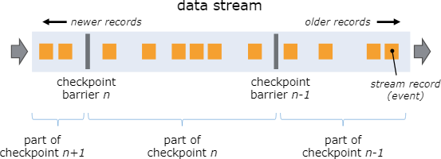
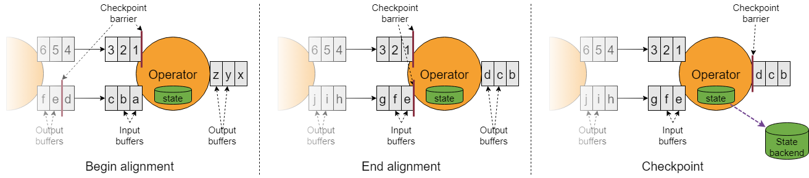

# 容错与状态快照

## 状态后端（State Backend）

Flink托管的带key状态（keyed state）是一种分片化的kv存储，被用到的部分会本地化存储在taskmanager本地。算子状态同样保存在使用者机器本地。

Flink托管的状态是存储在*状态后端（state backend）* 中的。状态后端有两种实现，一种是基于RocksDB，嵌入式的kv存储，将状态保存在磁盘中，另一种是基于堆的状态后端，将状态保存在Java堆中。

<table>
<tr><th>名称</th><th>存储位置</th><th>快照</th></tr>
<tr><td><b>EmbeddedRocksDBStateBackend</b></td><td>本地磁盘（tmp目录）</td><td>全量/增量</td></tr>
<tr><td colspan="3"><ul><li>支持大于可用内存的状态</li><li>注意：比基于堆的后端慢10倍</li></ul>
</td></tr>
<tr><td><b>HashMapStateBackend</b></td><td>JVM堆</td><td>全量</td></tr>
<tr><td colspan="3"><ul><li>速度快，需要大堆</li><li>受GC控制</li></ul>
</td></tr>
</table>

如果使用基于堆的状态后端，读写就是操作堆中的对象。如果使用`EmbeddedRocksDBStateBackend`，读写就要涉及到序列化和反序列化，代价也就更高。但RocksDB能承载的状态数量仅受限于本地磁盘的大小。而且要知道只有`EmbeddedRocksDBStateBackend`支持增量快照，对于拥有大量状态但不频繁更新的应用，这一点尤为有利。

这两种状态后端都支持异步快照，也就是说做快照的时候可以不影响当前的流处理。

## 检查点存储

Flink会为每一个算子的所有状态做周期性的持久化快照，而且还会把这些快照复制到持久化程度更高的地方，比如一个分布式文件系统。当系统出现异常时，Flink可以恢复完整的状态继续处理，好似什么都没发生。

这些快照的存储位置由*检查点存储（checkpoint storage）* 指定。有两种检查点存储的实现，一种可以持久化到分布式文件系统，另一种则利用JobManager的堆。

<table>
<tr><th>名称</th><th>状态备份</th></tr>
<tr><td><b>FileSystemCheckpointStorage</b></td><td>分布式文件系统</td></tr>
<tr><td colspan="2"><ul><li>支持超大状态规模</li><li>持久化程度高</li><li>推荐生成环境使用</li></ul>
</td></tr>
<tr><td><b>JobManagerCheckpointStorage</b></td><td>JobManager的JVM堆</td></tr>
<tr><td colspan="2"><ul><li>小规模状态的测试及实验使用</li></ul>
</td></tr>
</table>

## 状态快照

### 定义

- *快照*——泛指Flink作业的一个全局性的、一致的状态镜像。快照中包含数据源的指针（比如一个文件或者Kafka分区的偏移量），以及作业中每个有状态算子的一份状态副本，这份状态副本对应于数据源当前位置之前的全部处理结果。
- *检查点*——Flink自动创建快照，以防不测。检查点可以是递增的，而且为快速恢复做了优化。
- *外部检查点*——用户通常不会去操作检查点。当作业运行时，Flink只保留最近*n*个检查点（*n*可以配置），当作业取消时会删掉它们。但你可以把它们配置成不被删除的，这样可以手动选择从它们中进行恢复。
- *保存点*——运维时用户（或API调用）可能手动触发快照，比如做一次有状态的重新部署/升级/扩缩。保存点总是完整的，而且为运维提供了灵活性。

### 状态快照是如何进行的？

Flink采用了一种变形后的[Chandy-Lamport算法](https://en.wikipedia.org/wiki/Chandy-Lamport_algorithm)，称为*异步障栅快照（asynchronous barrier snapshotting）*。

当TaskManager收到来自检查点协调器（checkpoint coordinator，JobManager的一部分）的快照命令时，它会让所有的source记录它们的偏移量，并且在流中插入带编号的*检查点障栅*。这些障栅随着作业图（job graph）流转，划分出检查点前后的部分。

检查点*n*包含了每个算子处理**障栅n之前所有事件**的结果，**对于障栅n之后的所有事件都未处理**。

作业图中的每个算子收到这些障栅时都会对状态进行记录。如果算子有两个输入流（比如`CoProcessFunction`）会进行*障栅对齐*，让快照能反映出两个输入流中各自障栅之前数据处理后的结果。

Flink状态后端采用了copy-on-write，让正在进行的流处理不受影响，对旧版本的状态进行异步快照。当这些快照持久化存储之后，这些旧版本的状态才会被gc掉。

### Exactly Once保障

当流处理发生错误时，可能会丢数据，或者出现重复的结果。在Flink中，要看你为程序做了怎样的设定，以及运行在什么样的集群上，以下的结果都是可能出现的：

- 不做异常恢复（*at most once*）
- 不丢数，但是可能有重复的（*at least once*）
- 不丢数，也没有重复的（*exactly once*）

Flink会通过回退及重放source的数据流来实现异常恢复，我们把最理想的场景称为**exactly once**并*不是*说每个事件只会被处理一次。而是说*每个事件对Flink的托管状态只会影响exacyly once*。

障栅对齐只是为了保障exactly once。如果你不需要这种保障，可以给Flink配置`CheckpointingMode.AT_LEAST_ONCE`，此时会关闭障栅对齐，而且还能得到一些性能提升。

### Exactly Once端到端

为了实现端到端的exactly once，这样source的每个事件只会影响sink一次，必须要满足以下条件：

1. source要支持重放
2. sink必须支持事务（或幂等）

## 实操

这节的实操就是[Flink运维练习](../01尝试一下/04Flink运维练习.md)中的[异常恢复](../01尝试一下/04Flink运维练习.md#异常恢复)。