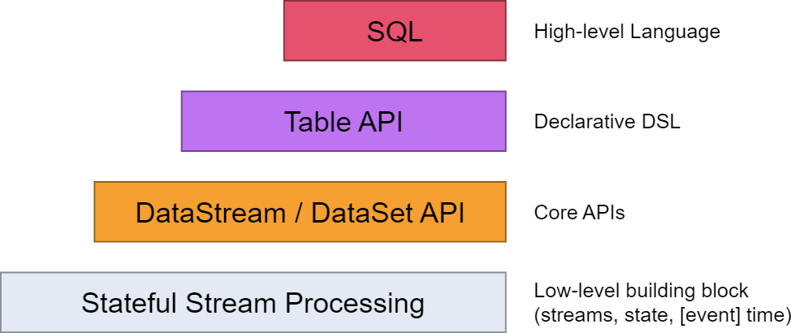

# 概要

前一章解释了有状态和实时流处理的基本概念，它们撑起了Flink的API，而且用例子演示了这些机制是如何使用的。[数据管道与ETL](../02学习Flink/03数据管道与ETL.md)中介绍了有状态流处理，在[容错](../02学习Flink/06容错.md)一节中进行了更加深入的介绍。而[流式分析](../02学习Flink/04流式分析.md)中又介绍了实时流处理。

本章要带你更加深入理解Flink的架构，以及运行时如何实现这些概念。

## Flink的API

Flink为流/批处理提供了不同层次的抽象。

- 最底层抽象仅提供**有状态和实时流处理**。它通过[ProcessFunction](../04应用开发/02DataStream%20API/06算子/04ProcessFunction.md)嵌入到了[DataStream API](../04应用开发/02DataStream%20API/01概要.md)中。它允许用户自由处理来自一个或多个流中的事件，同时还能提供一致性和容错性。此外，用户还能注册event time和processing time的回调，实现复杂的计算逻辑。
- 实际情况是大部分应用并不需要上面哪种底层的抽象，而是用**核心API**来编程：[DataStream API](../04应用开发/02DataStream%20API/01概要.md)（有界/无界流）。这些fluent API为数据处理提供了公共的构建基础，比如各式各样的变形处理、关联、聚合、窗口、状态处理等等。这些API处理的数据类型则由对应语言中的类（class）来表达。

    底层的*ProcessFunction*与*DataStream API*相集成，这样可以按需使用低级抽象。*DataSet API*为有界数据集提供了额外的原语，比如循环/迭代。

- **Table API**是一套关于*表*的声明式DSL，这些表可能是动态变化的（比如底层实际上是流）。[Table API](../04应用开发/03TableAPI和SQL/01概要.md)遵循（扩展的）关系模型：Table是有schema的（与关系库的表类似），API中也提供类似的方法，比如select、project、join、group-by、aggregate等。使用Table API声明式定义出*要完成什么样的逻辑操作*而不是明确给出*操作的代码应该是什么样子*。尽管可以通过多种类型的自定义函数来扩展Table API，但相对于*Core API*仍缺少表达力，用起来更加简洁（少写一些代码）。此外，Table API在执行前会经历一个优化过程，有一些优化规则。

    可以无缝地从table转换成*DataStream/DataSet*，在程序中混用*Table API*和*DataStream*以及*DateSet*。

- Flink提供的最高层抽象是**SQL**。这种抽象从语义和表达力上来看都跟*Table API*类似，但是要用SQL查询表达式来实现程序。这种[SQL](../04应用开发/03TableAPI和SQL/01概要.md)抽象与Table API紧密合作，可以用*Table API*定义出表，然后在上面执行SQL查询。