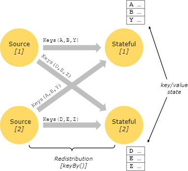
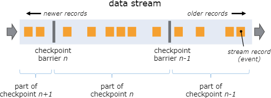
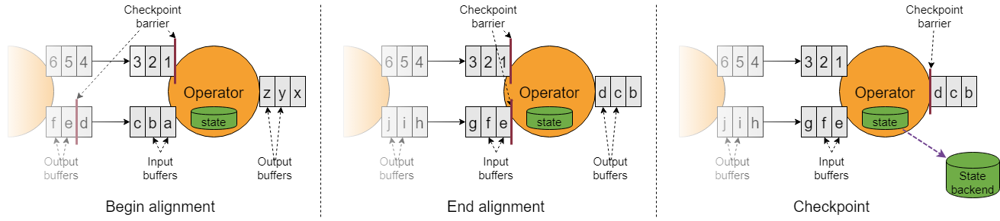
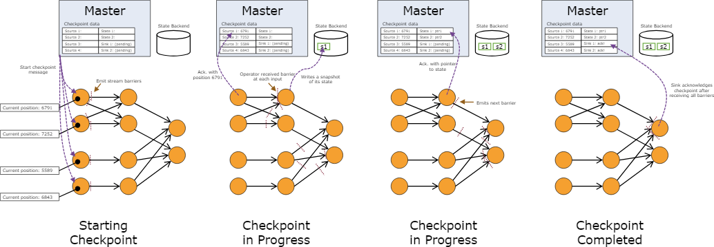
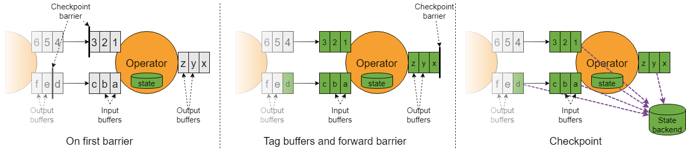
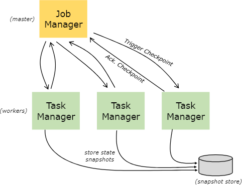

# 有状态流处理

## 什么是状态？

虽然大部分数据流操作对于每个*事件*只做单次处理（比如一个事件的parser），但有些操作需要跨越多个事件来记住一些信息（比如窗口算子）。这些操作就叫做**有状态的（stateful）**。

一些例子：

- 程序中要搜索特定的事件模式，要用状态来保存满足的事件。
- 按分钟/小时/天来聚合事件，状态中要保存未完成的聚合。
- 基于数据流训练一个机器学习模型，状态中要保存当前版本的模型参数。
- 需要处理历史数据，通过状态可以高效地访问过去的事件。

Flink需要用状态来实现[checkpoint](../04应用开发/02DataStream%20API/04状态和容错/03检查点.md)和[savepoint](../08运维/01状态与容错/03Savepoint.md)，实现容错。

状态信息还可用于应用的扩缩，Flink要处理多个并行实例上的状态再分发（redistributing）。

使用状态时，最好看一下[Flink状态后端]()。Flink提供了多种状态后端，状态保存的方式也不同。

## 带key状态（Keyed State）

带key状态被维护在一个嵌入式的kv存储中。这些状态跟流保持严格一致的分区和分发，有状态算子要用到它们。因此只有在*带key流（keyed stream）* 中才会用到这种kv状态，比如经过分key或分区后的数据交换，这种kv状态紧紧关联着当前事件的key。将流的key与状态相关联，就可以让所有状态的更新都变为本地化操作，不需要太多逻辑就可以保证一致性。这种关联可以让Flink透明地实现状态的重新分发以及流的分区。

带key状态会被进一步组织成所谓的*Key Group*。Flink重新分发Keyed State时，会以Key Group作为最小单元，Key Group的数量与并行度最大值保持一致。算子的每个并行实例要操作一个或多个Key Group。

## 状态持久化

Flink通过**流的重放**和**检查点**机制来实现容错。检查点会对每个输入流的特定位置做一个标记，并关联算子的对应状态。通过恢复算子状态以及从检查点进行重放的方式，可以实现保持一致性的数据流恢复(*exactly once语义*)。

检查点间隔是对容错带来的性能消耗与恢复时间（需要重放的记录个数）之间的取舍。

容错机制会对分布式数据流不停地进行快照。对于状态规模较小的流式应用，这些快照都是非常轻量的，可以频繁生成，对性能也没有什么影响。状态的存储位置是可以配置的，通常是配置到一个分布式文件系统上。

当程序出现异常时（由于机器、网络、软件本身导致的错误），Flink会停掉数据流。系统会重启算子并将它们重置到最新的检查点上。输入流则会重置到状态快照的对应位置上。重启后的数据处理不会对之前的检查点中保存的状态产生任何影响。

> 检查点是默认关闭的。如何开启和相关配置见[检查点](../04应用开发/02DataStream%20API/04状态和容错/03检查点.md)。

> 为了完整实现这种机制，数据流的source（比如消息队列或消息代理）需要支持流的回退。[Kafka](http://kafka.apache.org/)有这个能力，Flink连接Kafka的时候就利用了这一点。关于Flink连机器如何支持此类机制详见[Source和Sink的容错保障](../06连接器/01DataStream连接器/02容错保障.md)。

> 由于Flink的检查点基于分布式快照实现，我们对于*快照*和*检查点*这两个词的用法不做区分。通常还会用*快照*表示*检查点*或*保存点（savepoint）*。

### 检查点

Flink容错力的核心就是为分布式数据流和算子状态生成一致性快照。这些快照就像是一致的检查点，出现异常时系统可以恢复到这些位置上。关于如何生成快照，详见《[为分布式数据流实现轻量级异步快照](http://arxiv.org/abs/1506.08603)》。它受到标准的[Chandy-Lamport算法](http://research.microsoft.com/en-us/um/people/lamport/pubs/chandy.pdf)的启发，为Flink的执行模型做了专项优化。

所有和检查点相关的动作都可以是异步的。检查点障栅（barrier）的传播不会同步进行，会对状态进行异步的快照。

从1.11版本开始，检查点对齐可做可不做。本节我们先介绍带对齐的检查点。

#### 障栅（barrier）

Flink分布式快照的核心要素之一是*流的障栅（stream barrier）*。这些障栅被注入到数据流中，作为数据流的一部分，随着记录一起流转。障栅不会对记录形成挤占，它们是严格按顺序流转的。一个障栅会把数据流分为当前快照的部分，以及下一个快照的部分。障栅会带有快照的ID，会将障栅前的记录压入这个快照。障栅不会阻碍数据流的行进，因此都是非常轻量的。流中会同时出现不同快照的多个障栅，就是说多个快照会并发进行。

流的障栅会在source处注入到并行流中。快照*n*的障栅在source流的注入位置（暂且称为*Sn*）恰好能覆盖该快照的对应数据。比如对Kafka来说，这个位置就是最后一条记录在该partition中的offset。这个位置*Sn* 会上报给*checkpoint coordinator*（Flink的JobManager）。

障栅会流转到下游。当中间算子从它所有的输入流中接收到了快照*n*的障栅，它会给它所有的输出流设置快照*n*的障栅。当某个sink算子（DAG的末端）从所有输入流中收到障栅*n*，它会将快照*n*通知给checkpoint coordinator。当所有sink都通知了这个快照，那么这个快照就算是完成了。

当快照*n*完成后，作业便不会再向source请求*Sn* 之前的记录，因为此时这些记录（以及由它们生成的记录）已经走完了整个数据流。

如果算子有多个输入流，那么需要按照快照障栅对输入流进行*对齐*。上图展示了这种操作：

- 当算子从其中一个输入流中收到了障栅*n*，那么它就暂时不再处理这个流中的数据，直到从另一个流中也收到了障栅*n*。否则就会混淆快照*n*和快照*n+1*的数据。
- 当从最后一个流中收到障栅*n*，算子便会放出所有等待中的记录，并且加上它自己的快照*n*。
- 它对状态做个快照，然后恢复所有输入流的处理，先处理buffer中的数据，然后再处理流中的数据。
- 最后，算子会异步地将状态写入状态后端。

对于所有多输入流的算子都需要做这种对齐，这种多输入流也包括来自上游子任务产生的多个输出流。

#### 算子状态快照

不论算子包含了何种形式的*状态*，这个状态必须是快照的一部分。

当算子从它的输入流中收到了全部的快照障栅后，并且在向其输出流设置障栅之前，会为状态在这个点上做快照。此时，在此障栅之前所有记录的状态更新都已经做完了，而且不会对该障栅之后的记录做更新。由于快照的状态可能会比较大，它会被存储在一个可配置的[*状态后端（state backend）*](../08运维/01状态与容错/05状态后端.md)。这东西默认就在JobManager的内存中，但生成环境上应该配置成一个可靠的分布式存储（比如HDFS）。状态保存好后，算子会发出检查点通知，为其输出流设置快照障栅，然后继续处理后续数据。

此时生成的快照包含：

- 每个并行source流在快照开始时的offset/position
- 每个算子的状态指针也会被保存为快照的一部分

#### 恢复

这种机制下的恢复就很直接：出现异常时，Flink找出最新的完整检查点*k*。系统会重新部署整个数据流，并根据检查点*k*的快照给每个算子设置对应的状态。source会被设置成从位置*Sk* 开始读取。对于Kafka就是让consumer从偏移量*Sk* 开始读数。

如果做的是增量快照，算子会首先使用最新的全量快照，然后在这个基础上应用一连串的增量快照。

更多细节见[重启策略](../08运维/01状态与容错/07任务的异常恢复.md)。

### 不做对齐的检查点

检查点可以不做对齐。其基本思想是检查点会超过所有传输中的数据，只要这些数据都可以称为算子状态的一部分。

这种做法实际上非常类似于[Chandy-Lamport算法](http://research.microsoft.com/en-us/um/people/lamport/pubs/chandy.pdf)，但Flink仍会在source中插入障栅，避免给checkpoint coordinator带来太多压力。

上图展示了无对齐的检查点是如何实现的：

- 算子要对其输入缓冲区中的第一个障栅做出响应。
- 它会立即讲该障栅转发到下游算子，将它添加到其输出缓冲的末尾。
- 算子对所有被超越的异步存储记录进行标记，并对自身状态创建快照。

结果就是算子只会做短暂停顿，给缓冲区中的内容做标记，转发障栅，创建快照。

无对齐检查点可以确保障栅能快速到达sink。当应用中存在某个流转特别缓慢的路径时，这种思路非常合适，此时若做对齐可能需要长达几个小时。但由于它带来了额外的IO压力，如果状态后端的IO是瓶颈的话，这种方法可能适得其反。关于这些限制的更多内容见[检查点](../08运维/01状态与容错/01检查点.md)。

对于保存点（savepoint）总是需要做对齐的。

### 状态后端（state backend）

具体存储的kv索引数据结构依赖于所选的[状态后端](../08运维/01状态与容错/05状态后端.md)。一种状态后端是将数据存在内存哈希表中，另一种则是利用[RocksDB](http://rocksdb.org/)作为kv存储。除了要定义存储的数据结构，状态后端还要实现对kv状态做瞬时快照的逻辑，并且将快照作为检查点的一部分保存起来。状态后端的配置不影响你的应用逻辑。

### 保存点（savepoint）

所有用到检查点的程序都可以从**保存点**来恢复执行。保存点允许你更新程序或Flink集群，而不丢失任何状态。

[保存点](../08运维/01状态与容错/03Savepoint.md)是**手动触发的检查点**，它对程序做一个快照然后将它保存到状态后端中。在这一点上它依赖于常规的检查点机制。

保存点跟检查点是类似的，但它是由**用户触发的**，而且当有新的检查点完成时它也**不会自动过期**。为了合理利用保存点，要明白[检查点](../08运维/01状态与容错/01检查点.md)和[保存点](../08运维/01状态与容错/03Savepoint.md)的区别，详见[检查点vs保存点](../08运维/01状态与容错/04检查点vs保存点.md)。

### 精确一次 vs. 至少一次

对齐操作可能会为流式处理增加延迟。这种延迟通常是毫秒级的，但我们也遇到过一些延迟显著增长的场景。如果应用要求所有记录都要满足一致的超低延迟（几毫秒），Flink支持检查点不做对齐。检查点快照仍旧是当算子从每个输入中收到检查点障栅时就开始生成。

如果不做对齐，算子要持续处理所有的输入，即便是收到了检查点*n*的障栅。此时，在创建检查点*n*的快照之前，算子仍要处理检查点*n+1*的数据。在状态恢复时，这些数据会重复出现，因为它们被同时包含在了检查点*n*的状态快照中，会作为检查点*n*之后的数据的一部分进行重放。

> 对齐操作仅限于那些具有多个前驱（如join操作）的算子，以及具有多个上游（比如经过流的再分区/shuffle）的算子。因此对于仅做简单并行化处理的操作（`map()`、`flatMap()`、`filter()`，……），即便设运行在*at least once*模式下，实际上也会得到*exactly once*保障。

## 批处理下的状态与容错

Flink把批处理作为特殊的流处理来执行，[ExecutionMode](../04应用开发/02DataStream%20API/14Execution管理/01Execution配置.md)为BATCH，代表此时的流是有界的（有限个元素）。上面讲过的那些概念因此可以同样地应用在批处理程序中，仅有一些小的不同：

- [批处理程序的容错](../08运维/01状态与容错/07任务的异常恢复.md)不做检查点。恢复时直接对流做完全重放。这样时可行的，因为输入是有界的。这样虽然恢复时的代价较高，但让正常的数据处理更加简单，因为它去掉了检查点操作。
- 批处理执行模式下的状态后端采用简化了的内存/外存数据结构，而非kv索引。