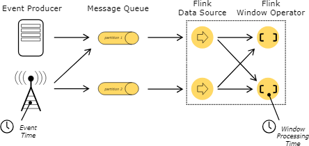
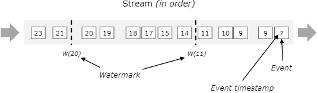
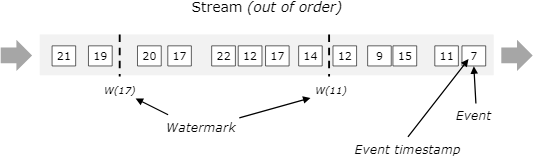
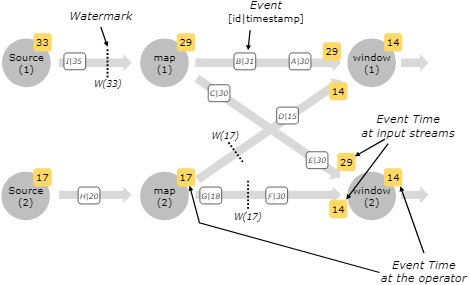
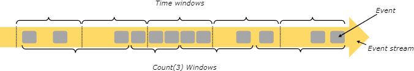

# 即时流处理

## 介绍

即时流处理是对[有状态流处理](02有状态流处理.md)的一种扩展，时间在这里扮演了新的角色。就比如你要做时序数据分析、基于时间段（一般叫做窗口）的聚合，或者是在事件处理时事件发生的时间对你来说非常重要。

下面的内容着重介绍了几个主题，这些都是你在做即时流处理时需要考虑的东西。

## 时间概念：Event Time和Processing Time

在流式应用中用到的时间（比如定义窗口），我们所参考的可能是不同的*时间*概念：

- **Processing time**：执行操作时机器的系统时间。

    如果流式应用采用了processing time，所有基于时间的操作（比如时间窗口）都会使用算子所在机器的系统时间。一个小时级的processing time窗口包括了算子在完整的一个小时的系统时间内收到的所有记录。比如应用启动时间为9:15，第一个小时级的processing time窗口包括了从9:15到10:00的数据，下一个窗口则是10:00到11:00，以此类推。

    Processing time是最简单的时间概念，不需要在流和机器之间做什么协调。它的性能最好，延迟最低。但是在分布式及异步处理的环境中，它无法提供确定性，因为它容易受到数据抵达系统速度的影响（比如来自消息队列的数据），以及数据在算子之间流转速度的影响，还有计划内或计划外的系统中断带来的影响。

- **Event time**：Event time是指每个事件在其终端设备产生的时间。这个时间通常在到达Flink之前就已经生成了，而且可以从每条数据中提取出它的*event timestamp*。此时，时间的进度取决于数据本身，而不是客观时间。这样的程序必须要定义如何生成*Event Time Watermark*，它用来给出event time的进度，这种机制[下面](#event-time和watermark)会详细介绍。

    在理想情况下，event time的处理可以实现完全一致且确定的结果，而不受事件抵达时间的影响，也不受其顺序影响。但除非事件已知是有序（按时间戳）抵达，否则处理时就会为了等待无序事件的到达而产生一定的延迟。然而等待的时间肯定只能是一个有限的时间，这样就制约了此类型应用的确定性程度。

    假设所有数据现在都已到达，操作就会按预期执行，即便事件是无序的，而且还有迟到的事件，或者是需要重新处理一些历史数据，依然能够生成正确且一致的结果。比如一个小时级的event time窗口包含了数据本身的event timestamp落入该小时内的全部数据，而不是看它们抵达的顺序，或者是被处理的时间。（[迟到](#迟到)一节中有更详细的介绍。）

    注意event time程序在处理实时数据时，有的时候会使用*processing time*来做一些动作，保证程序的有序运转。

    

## Event Time和Watermark

*注意：Flink的实现了很多Dataflow Model中的技术。关于event time和watermark的更多介绍可以看看下面的论文。*

- [Streaming 101](https://www.oreilly.com/radar/the-world-beyond-batch-streaming-101/)
- [Dataflow Model](https://static.googleusercontent.com/media/research.google.com/en//pubs/archive/43864.pdf)

为了支持*event time*，处理时需要能够度量出时间的进度。比如一个窗口算子，搞了小时级的窗口，那就需要知道event time何时超过了这个小时，这样算子才能把当前窗口关掉。

*event time*的进度和*processing time*（由客观时间度量）的进度是互相独立的。比如某个程序中算子当前的*event time*稍稍落后于*processing time*（由于接收事件有延迟），二者以相同的速度递进。另一种情况则是流处理程序可能在几秒钟之内处理了好几周的event time事件，比如缓冲在Kafka（或其他消息队列）中的历史数据快速泄洪。

---

Flink用来度量event time进度的方法就是**watermark**。Watermark与数据一同流转，携带一个时间戳*t*。*Watermark(t)*表示流中的event time已经到达时刻*t*，意味着流中的元素不会再有时间戳*t'*<=*t*（事件时间戳不会早于或等于watermark）。

下图展示了一个带有（逻辑）时间戳的事件流，watermark也在里面。这个例子中的事件是有序的（按照时间戳），此时的watermark相当于流中的一个周期性的标记。

Watermark对于*无序*流是非常重要的，如下图所示，事件并不按照时间戳的顺序排列。Watermark算是流中的一个点位声明，表示某个时间戳之前的所有事件都应该已经抵达了。当watermark走到了一个算子处，算子可以将其内部的*event time clock*递进调整为该watermark的值。

流处理中由一个元素生成另一个元素时，后者会继承前者的event time，或者是由watermark触发的新元素创建，也会继承watermark的event time。

### 并行流中的watermark

Watermark的生成位于或紧随source函数。source函数的每个并行子任务通常是独自生成自己的watermark。这些watermark定义了特定的并行source的event time。

watermark进行流转，抵达算子时会推进算子的event time。当算子推进event time时，它会为下游的后续算子生成一个新的watermark。

有些算子有多个输入流，比如一次union操作，或者跟在*keyBy(...)* 或*partition(...)* 函数后面的算子。这种算子的当前event time是它所有输入流中event time的最小值。随着输入流的event time更新，算子也更新自己的event time。

下图展示了这种情况。

## 迟到

某些元素可能会违反watermark的声明，就是说即便*Watermark(t)* 出现了，后面依然出现了时间戳*t'*<=*t*的元素。实际情况中这种类型的元素的延迟可能是任意的，这就导致几乎不可能声明出一个时间，表示某段时间的元素都已经到达了。而且，即便延迟是有界的，把watermark延迟太多通常也不可取，因为它会导致窗口的计算延迟同步增加。

基于这些原因，流式应用可以显式等待某些*迟到*元素。迟到的元素是指其时间戳早于或等于watermark时间，但是晚于watermark到达的元素。[迟到容忍](../04应用开发/02DataStream%20API/06算子/02窗口.md#迟到容忍)中介绍了更多关于event time窗口中如何处理迟到元素的知识。

## 窗口

流处理和批处理中的事件聚合（比如计数或求和）是不一样的。比如在流处理中是无法对流中所有元素进行计数的，因为流是无限（无界）的。因此，流上的聚合（计数、求和等）就要用到**窗口**，比如“对过去5分钟计数”、“对过去的100个元素求和”。

窗口可以是*时间驱动*（比如每30秒），也可以是*数据驱动*（比如每100个元素）。这通常可以区分出不同类型的窗口，比如*tumbling window*（无重叠），*sliding window*（有重叠），*session window*（有不活跃间隔）。

[这篇文章](https://flink.apache.org/news/2015/12/04/Introducing-windows.html)有一些其他的窗口示例，也可以去看看DataStream API中关于[窗口的文档](../04应用开发/02DataStream%20API/06算子/02窗口.md)。