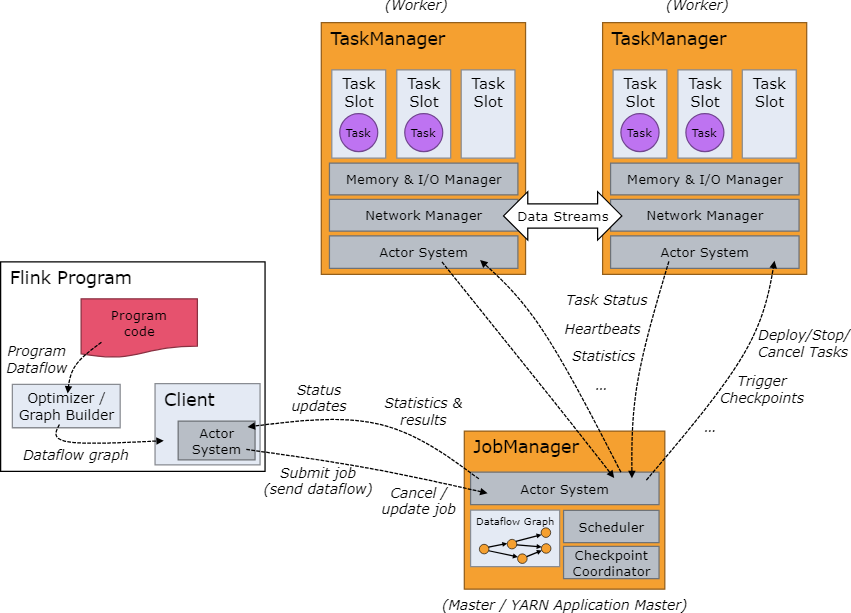

# Flink架构

Flink是一套分布式系统，为了执行流处理应用，需要高效的分配和管理计算资源。它可以集成到所有常用的集群资源管理器上，比如[YARN](https://hadoop.apache.org/docs/stable/hadoop-yarn/hadoop-yarn-site/YARN.html)和[Kuberentes](https://kubernetes.io/)，但也可以作为一个独立集群来运行，甚至是作为一个库来用。

本文为你介绍Flink架构，以及它的主要构件是如何来跑作业并进行异常恢复的。

## Flink集群详解

Flink运行时包含两类进程：一个*JobManager*，一个或多个*TaskManager*。

*Client*并不属于运行时和程序执行的一部分，但用来准备并提交数据流到JobManager。在这之后client就可以断开了（*detached mode*），也可以保持连接并接收进度反馈（*attached mode*）。client既可以作为Java/Scala程序的一部分来触发执行，也可以作为命令行`./bin/flink run ....`。

JobManager和TaskManager可能以不同的方式启动：直接在机器上作为[独立集群](../07部署/03资源支撑/01独立部署/01概要.md)，或者是在容器里，或者是托管给[YARN](../07部署/03资源支撑/03YARN.md)这种东西。TaskManager会连接到JobManager上，声明自己的可用性，接收任务分配。

